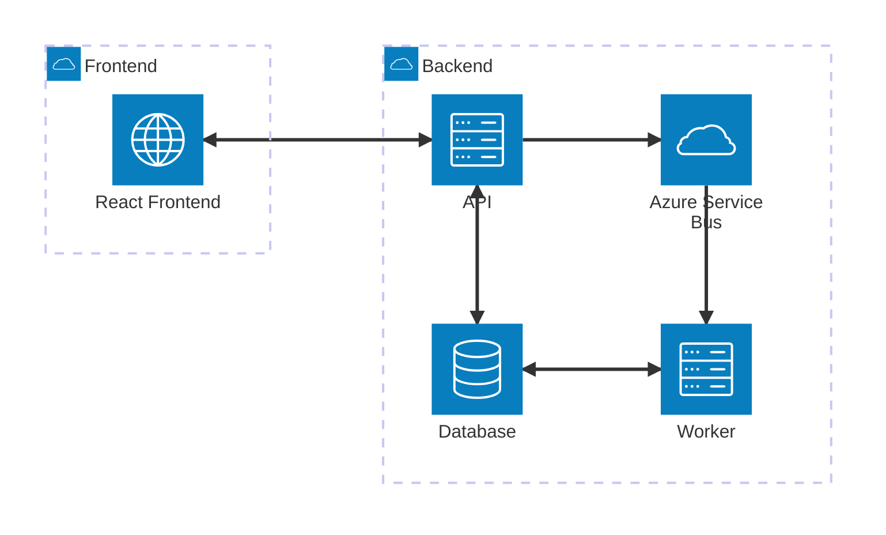

# projeto-poc-tmb

Projeto completo desafio POC TMB

# Arquitetura


# Instruções para execução

```
projeto-poc-tmb/
├── backend/
│   ├── api-poc-tmb/...
│   ├── worker-orders/...
│   └── docker-compose.yml
├── frontend/
│   ├── public/...
│   ├── src/...
│   ├── package.json
│   └── tailwind.config.js
├── README.md
└── .gitignore
```

## Pré-requisitos

* Git
* Docker & Docker Compose (Docker Desktop com WSL2 recomendado no Windows)
* (Opcional, para rodar sem Docker) .NET 8 SDK e Node.js 18+ / npm

### Estrutura (esperada)
```
backend/
  docker-compose.yml  -> docker-compose do projeto
  api-poc-tmb/        -> projeto API (.NET)
  worker-orders/      -> projeto Worker (.NET)
frontend/             -> React + Vite app
```

## Variáveis de ambiente / configuração

### Frontend
Coloque frontend/.env com:
```
VITE_BASE_API_URL='URL do backend'
```

### Backend

Configurações (connection strings, service bus, etc.) estão em backend/api-poc-tmb/appsettings.json para desenvolvimento.

## Execução com Docker Compose

* As variáveis de ambiente estão no `backend/docker-compose.yml`

### Execute:
```
docker-compose up --build
```

### Acesse:

API: http://localhost:3000

Frontend: http://localhost:8000
